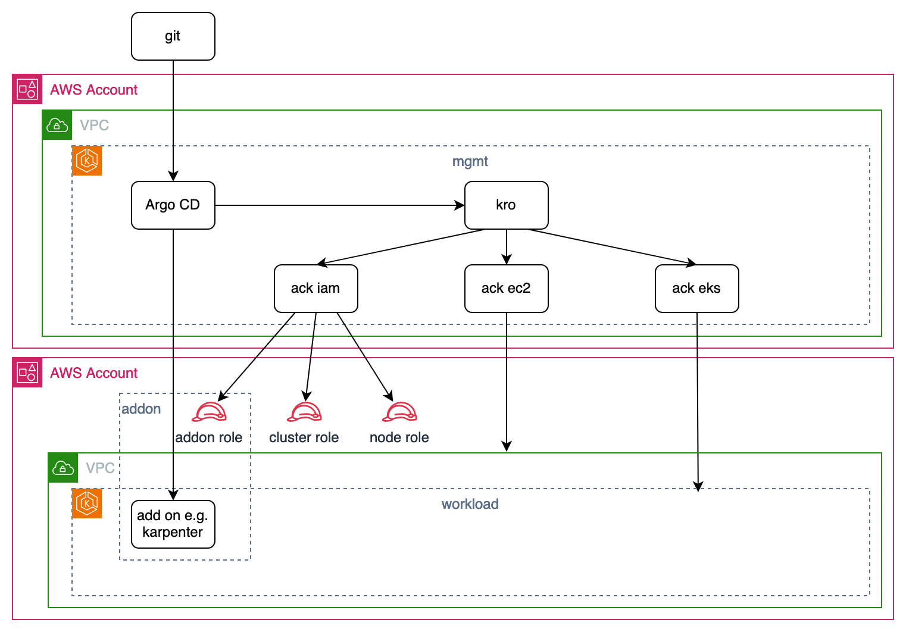

# Amazon EKS cluster management using kro & ACK

This example demonstrates how to manage a fleet of EKS clusters using kro, ACK,
and ArgoCD -- it creates EKS clusters, and bootstraps them with the required
add-ons

A hub-spoke model is used in this example; a management cluster (hub) is created
as part of the initial setup and the controllers needed for provisioning and
bootstrapping workload clusters (spokes) are installed on top.



**NOTE:** As this example evolves, some of the instructions below will be
detailed further (e.g. the creation of the management cluster), others (e.g.
controllers installation) will be automated via the GitOps flow.

## Prerequisites

1. AWS account for the management cluster
2. AWS account for workload clusters; each with the following IAM roles:

   - `eks-cluster-mgmt-ec2`
   - `eks-cluster-mgmt-eks`
   - `eks-cluster-mgmt-iam`

   The permissions should be as needed for every controller. Trust policy:

   ```json
   {
     "Version": "2012-10-17",
     "Statement": [
       {
         "Effect": "Allow",
         "Principal": {
           "AWS": "arn:aws:iam::<mgmt-account-id>:role/ack-<srvc-name>-controller"
         },
         "Action": "sts:AssumeRole",
         "Condition": {}
       }
     ]
   }
   ```

## Instructions

### Environment variables

1. Use the snippet below to set environment variables. Replace the placeholders
   first (surrounded with`<>`):

```sh
export KRO_REPO_URL="https://github.com/awslabs/kro.git"
export WORKSPACE_PATH=<workspace-path> #the directory where repos will be cloned e.g. ~/environment
export 382076407153=$(aws sts get-caller-identity --output text --query Account)
export us-west-2=<region> #e.g. us-west-2
export kro-mgmt=mgmt
export GITHUB_REPO_NAME=cluster-mgmt
export ARGOCD_CHART_VERSION=7.5.2
export 382076407153S="111222333444 222333444555" # list of aws accounts you want to be able to manage from management cluster
```

### Management cluster

2. Create an EKS cluster (management cluster)
    You can create it with your prefered method, or use the command below:
    ```bash
    aws eks create-addon --cluster-name $kro-mgmt --addon-name eks-pod-identity-agent --addon-version v1.3.4-eksbuild.1
    ```

### Repo

3. Clone kro repo:

    ```sh
    git clone $KRO_REPO_URL $WORKSPACE_PATH/kro
    ```

4. Create the GitHub repo `${GITHUB_REPO_NAME}` in your organization; it will contain
   the clusters definition, and it will be reconciled to the management cluster
   via the GitOps flow

5. Save the URL of the created repo in an environment variable:

    ```sh
    export https://github.com/allamand/kro-mgmt.git=<repo-url> #e.g. https://github.com/iamahgoub/${GITHUB_REPO_NAME}.git
    ```

6. Clone the created repo:

    ```sh
    git clone $https://github.com/allamand/kro-mgmt.git $WORKSPACE_PATH/${GITHUB_REPO_NAME}
    ```

7. Populate the repo:

    ```sh
    cp -r $WORKSPACE_PATH/kro/examples/eks-cluster-mgmt/* $WORKSPACE_PATH/${GITHUB_REPO_NAME}

    find $WORKSPACE_PATH/${GITHUB_REPO_NAME} -type f -not -path "*/scripts/*" -exec sed -i "s~382076407153~$382076407153~g" {} +
    find $WORKSPACE_PATH/${GITHUB_REPO_NAME} -type f -not -path "*/scripts/*" -exec sed -i "s~https://github.com/allamand/kro-mgmt.git~$https://github.com/allamand/kro-mgmt.git~g" {} +
    find $WORKSPACE_PATH/${GITHUB_REPO_NAME} -type f -not -path "*/scripts/*" -exec sed -i "s~us-west-2~$us-west-2~g" {} +
    find $WORKSPACE_PATH/${GITHUB_REPO_NAME} -type f -not -path "*/scripts/*" -exec sed -i "s~kro-mgmt~$kro-mgmt~g" {} +
    find $WORKSPACE_PATH/${GITHUB_REPO_NAME} -type f -not -path "*/scripts/*" -exec sed -i "s~oidc.eks.us-west-2.amazonaws.com/id/509522E31117C4C5CAF626FD5669C414~$oidc.eks.us-west-2.amazonaws.com/id/509522E31117C4C5CAF626FD5669C414~g" {} +
    ```

8. Push the changes

    ```sh
    cd $WORKSPACE_PATH/${GITHUB_REPO_NAME}
    git add .
    git commit -m "initial setup"
    git push
    cd $WORKSPACE_PATH
    ```

9. Create IAM OIDC provider for the cluster:

    ```sh
    eksctl utils associate-iam-oidc-provider --cluster $kro-mgmt --approve
    ```

10. Save OIDC provider URL in an environment variable:

    ```sh
    oidc.eks.us-west-2.amazonaws.com/id/509522E31117C4C5CAF626FD5669C414=$(aws eks describe-cluster --name $kro-mgmt --region $us-west-2 --query "cluster.identity.oidc.issuer" --output text | sed -e "s/^https:\/\///")
    ```

1. Install the following ACK controllers on the management cluster:

    * Create IAM Roles and associates with Pod Identity

        ```bash
        ./scripts/create_ack_roles.sh 
        ```

    * Install controllers
        - ACK IAM controller
        - ACK EC2 controller
        - ACK EKS controller

        **NOTES:** 
        - Make sure to enable CARMv2 by setting the feature flags `ServiceLevelCARM` and `TeamLevelCARM` to true.
        - Make sure to grant IAM permissions to assume role in workload cluster accounts

        You can execute the following snippet:

        ```bash
        #Login to public ECR
        aws ecr-public get-login-password --region us-east-1 | helm registry login --username AWS --password-stdin public.ecr.aws
        #Install ACK controllers
        for SERVICE in iam ec2 eks; do
            export RELEASE_VERSION=$(curl -sL https://api.github.com/repos/aws-controllers-k8s/${SERVICE}-controller/releases/latest | jq -r '.tag_name | ltrimstr("v")')
            export ACK_SYSTEM_NAMESPACE=ack-system

            helm install --create-namespace -n $ACK_SYSTEM_NAMESPACE ack-$SERVICE-controller \
            oci://public.ecr.aws/aws-controllers-k8s/$SERVICE-chart --version=$RELEASE_VERSION --set=aws.region=$us-west-2 \
            --set=featureGates.ServiceLevelCARM=true --set=featureGates.TeamLevelCARM=true
        done
        ```


6. Install kro on the management cluster. Please note that this example is
   tested on 0.1.0.

    ```sh
    aws ecr-public get-login-password --region us-east-1 | helm registry login --username AWS --password-stdin public.ecr.aws
    helm install kro oci://public.ecr.aws/kro/kro \
    --namespace kro \
    --create-namespace \
    --version=0.1.0
    ```
7. Install EKS pod identity add-on (If not already done):

    ```sh
    aws eks create-addon --cluster-name $kro-mgmt --addon-name eks-pod-identity-agent --addon-version v1.0.0-eksbuild.1
    ```


### ArgoCD installation

14. Create an IAM role for ArgoCD on the management cluster and associated with
    ArgoCD `ServiceAccount`:

    ```sh
    ROLE_NAME=argocd-hub-role
    POLICY_NAME=argocd-policy

    cat >$POLICY_NAME.json <<EOF
    {
        "Version": "2012-10-17",
        "Statement": [
            {
                "Action": [
                    "sts:AssumeRole",
                    "sts:TagSession"
                ],
                "Effect": "Allow",
                "Resource": "*"
            }
        ]
    }
    EOF

    aws iam create-policy --policy-name $POLICY_NAME --policy-document file://$POLICY_NAME.json

    cat >argocd-trust-relationship.json <<EOF
    {
        "Version": "2012-10-17",
        "Statement": [
            {
                "Sid": "AllowEksAuthToAssumeRoleForPodIdentity",
                "Effect": "Allow",
                "Principal": {
                    "Service": "pods.eks.amazonaws.com"
                },
                "Action": [
                    "sts:AssumeRole",
                    "sts:TagSession"
                ]
            }
        ]
    }
    EOF


    # clean : 

    for policy in $(aws iam list-attached-role-policies --role-name "${ROLE_NAME}" --query 'AttachedPolicies[*].PolicyArn' --output text); do
        aws iam detach-role-policy --role-name "${ROLE_NAME}" --policy-arn "$policy"
    done

    # Delete any inline policies
    for policy in $(aws iam list-role-policies --role-name "${ROLE_NAME}" --query 'PolicyNames[*]' --output text); do
        aws iam delete-role-policy --role-name "${ROLE_NAME}" --policy-name "$policy"
    done
    aws iam delete-role --role-name "${ROLE_NAME}"

    # Create
    aws iam create-role --role-name "${ROLE_NAME}" --assume-role-policy-document file://argocd-trust-relationship.json --description ""
    aws iam attach-role-policy --role-name "${ROLE_NAME}" --policy-arn=arn:aws:iam::$382076407153:policy/$POLICY_NAME

    aws eks create-pod-identity-association --cluster-name $kro-mgmt --role-arn arn:aws:iam::${382076407153}:role/"${ROLE_NAME}" --namespace argocd --service-account argocd-application-controller
    ```

15. Install ArgoCD helm chart:

    ```bash
    helm repo add argo-cd https://argoproj.github.io/argo-helm
    helm upgrade --install argocd argo-cd/argo-cd --version $ARGOCD_CHART_VERSION \
    --namespace "argocd" --create-namespace \
    --set server.service.type=LoadBalancer \
    --wait
    ```

### Bootstrapping

16. Create ArgoCD `Repository` resource that points to `${GITHUB_REPO_NAME}` repo
    created in an earlier instruction


17. Apply the bootstrap ArgoCD application:

    ```sh
    kubectl apply -f $WORKSPACE_PATH/${GITHUB_REPO_NAME}/gitops/bootstrap.yaml
    ```

### Adding workload clusters

18. Add the cluster name and corresponding account number in
    `charts-values/ack-multi-account/values.yaml`.
19. Commit/push the changes to Git, then wait for the sync operation to complete by checking ArgoCD UI.
20. Add a workload cluster by adding a manifest for it under `clusters/`. Refer to `clusters/workload1.yaml` as an example.
21. Include the new cluster manifest in `clusters/kustomization.yaml`.
22. Commit/push the changes to Git, then wait for the sync operation to complete by checking ArgoCD UI. Finally, log on to the workload cluster account to confirm that the cluster is created as expected.

### connect to ArgoCD UI

```bash
echo "ArgoCD URL: https://$(kubectl get svc argocd-server -n argocd -o jsonpath='{.status.loadBalancer.ingress[0].hostname}')
Username: admin
Password: $(kubectl -n argocd get secret argocd-initial-admin-secret -o jsonpath="{.data.password}" | base64 -d)"
```

## Clean-up

1. Delete ArgoCD bootstrap application, and wait for workload clusters and
   hosting VPCs to be deleted:

```sh
kubectl delete application bootstrap -n argocd
```

2. Uninstall ArgoCD helm chart

```sh
helm uninstall argocd -n argocd
```

3. Delete ArgoCD IAM role and policy

```sh
aws iam delete-role --role-name argocd-hub-role
```

4. Delete ArgoCD IAM policy

```sh
aws iam delete-policy --policy-arn arn:aws:iam::$382076407153:policy/argocd-policy
```

5. Delete ACK controllers and kro
6. Delete the management cluster


## Drifted / Force Deleting

In case you have drift between your intend (ACK controller) and what is deployed, you can forcelly clean resources using following commands

```bash
kubectl get subnets --all-namespaces -o custom-columns=NAMESPACE:.metadata.namespace,NAME:.metadata.name --no-headers | \
while read -r namespace name; do
    echo "Processing subnet $name in namespace $namespace"
    kubectl patch subnet $name -n $namespace --type json -p '[{"op": "remove", "path": "/metadata/finalizers"}]'
    kubectl delete subnet $name -n $namespace
done

```